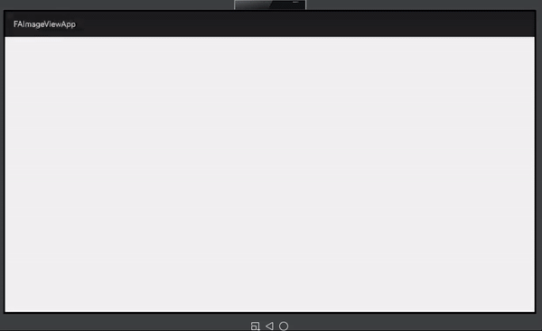

[](https://github.com/applibgroup/FAImageView/actions/workflows/main.yml)
[](https://sonarcloud.io/summary/new_code?id=applibgroup_FAImageView)
# FAImageView

FAImageView is a HMOS Library called Frame Animation ImageView. You can animate multiple image.

## Source

Inspired by [skyfe79/FAImageView](https://github.com/skyfe79/FAImageView) 

## Features
You can set multiple frame images and start frame animation like UIImageView in iOS. This library internally uses 
[OHOSChannel](https://github.com/applibgroup/OHOSChannel)

FAImageView provides some listeners for animation event.

 * for listening to animation start-OnStartAnimationListener
 * for listening to animation completion-OnFinishAnimationListener
 * for listening to animation frame change event-OnFrameChangedListener
 
APIs
 * setInterval(int milli)-set frame interval for animation in milli seconds
 * addImageFrame(int resId), addImageFrame(Element drawable), addImageFrame(PixelMap bitmap)-add an Image Frame
 * setLoop(boolean loop)-If you want to animate infinitely set true or false. Default value is false
 * setRestoreFirstFrameWhenFinishAnimation(boolean restore)-If you want to restore the first frame when animation is finished, set true or false
 * setAnimationRepeatCount(int animationRepeatCount)-Only If your animation is not infinity, this value is valuable       
 * startAnimation()-start animation
 * stopAnimation()-stop animation
 * isAnimating()-check it's now animating   
 * reset()-clear all resources and stop animation
  


## Dependency

1.For using FAImageView module in sample app, include the source code and add the below dependencies in entry/build.gradle to generate hap/support.har.
```groovy
dependencies {
        implementation fileTree(dir: 'libs', include: ['*.jar', '*.har'])
        testImplementation 'junit:junit:4.13.1'
        ohosTestImplementation 'com.huawei.ohos.testkit:runner:1.0.0.200'
        implementation project(':faimageview')
    }
```

2.For using FAImageView in separate application using har file, add the har file in the entry/libs folder and add the dependencies in entry/build.gradle file.
```groovy
dependencies {
        implementation fileTree(dir: 'libs', include: ['*.jar'])
        testImplementation 'junit:junit:4.13.1'
    }
```
3.For using FAImageView from a remote repository in separate application, add the below dependencies in entry/build.gradle file.
```groovy
dependencies {
        implementation 'dev.applibgroup:faimageview:1.0.0'  
        testCompile 'junit:junit:4.13'
    }
```
## Usage

#### Xml
Declare FAImageView widget in the layout xml file.
```xml
    <kr.pe.burt.hmos.lib.faimageview.FaImageView
        ohos:id="$+id:faimageview1"
        ohos:width="match_parent"
        ohos:height="0vp"
        ohos:weight="1"/>

    <kr.pe.burt.hmos.lib.faimageview.FaImageView
        ohos:id="$+id:faimageview2"
        ohos:width="match_parent"
        ohos:height="0vp"
        ohos:weight="1"/>
```

#### Java
Set the options you want
```java
        faImageView1 = (FaImageView) findComponentById(ResourceTable.Id_faimageview1);
        faImageView1.setInterval(30);
        faImageView1.setLoop(true);
        faImageView1.addImageFrame(ResourceTable.Media_frame01);
        faImageView1.addImageFrame(ResourceTable.Media_frame02);
        faImageView1.addImageFrame(ResourceTable.Media_frame03);
        faImageView1.addImageFrame(ResourceTable.Media_frame04);
        faImageView1.addImageFrame(ResourceTable.Media_frame05);
        faImageView1.addImageFrame(ResourceTable.Media_frame06);
        faImageView1.addImageFrame(ResourceTable.Media_frame07);
        faImageView1.addImageFrame(ResourceTable.Media_frame08);
        faImageView1.addImageFrame(ResourceTable.Media_frame09);
        faImageView1.addImageFrame(ResourceTable.Media_frame10);
```

```java
        faImageView.setOnStartAnimationListener(new FaImageView.OnStartAnimationListener() {
            @Override
            public void onStartAnimation() {
                HiLog.debug(HILOG_LABEL, "Animation started");
            }
        });
        faImageView.setOnFinishAnimationListener(new FaImageView.OnFinishAnimationListener() {
            @Override
            public void onFinishAnimation(boolean isLoopAnimation) {
                if (isLoopAnimation) {
                    HiLog.debug(HILOG_LABEL, "Finish an animation cycle");
                } else {
                    HiLog.debug(HILOG_LABEL, "Animation Finished");
                }
                present(new MainAbilitySlice(), new Intent());
            }
        });
        faImageView.setOnFrameChangedListener(new FaImageView.OnFrameChangedListener() {
            @Override
            public void onFrameChanged(int index) {
                HiLog.debug(HILOG_LABEL, String.format("frame has changed %d", index));
            }
        });
    }
```

## License

The MIT License

Copyright © 2015 Sungcheol Kim, http://github.com/skyfe79/FAImageView

Permission is hereby granted, free of charge, to any person obtaining a copy
of this software and associated documentation files (the "Software"), to deal
in the Software without restriction, including without limitation the rights
to use, copy, modify, merge, publish, distribute, sublicense, and/or sell
copies of the Software, and to permit persons to whom the Software is
furnished to do so, subject to the following conditions:

The above copyright notice and this permission notice shall be included in
all copies or substantial portions of the Software.

THE SOFTWARE IS PROVIDED "AS IS", WITHOUT WARRANTY OF ANY KIND, EXPRESS OR
IMPLIED, INCLUDING BUT NOT LIMITED TO THE WARRANTIES OF MERCHANTABILITY,
FITNESS FOR A PARTICULAR PURPOSE AND NONINFRINGEMENT. IN NO EVENT SHALL THE
AUTHORS OR COPYRIGHT HOLDERS BE LIABLE FOR ANY CLAIM, DAMAGES OR OTHER
LIABILITY, WHETHER IN AN ACTION OF CONTRACT, TORT OR OTHERWISE, ARISING FROM,
OUT OF OR IN CONNECTION WITH THE SOFTWARE OR THE USE OR OTHER DEALINGS IN
THE SOFTWARE.
